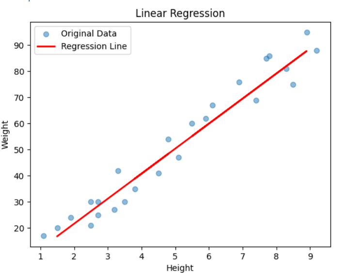

# 📊 Linear Regression on Synthetic Data

## 📝 Problem Statement
The objective of this project is to predict a person's **Weight** based on their **Height** using a simple Linear Regression model.  
The dataset consists of synthetic records containing height and weight values.

---

## 🔎 Approach
1. **Data Loading**: The dataset was read using Pandas.  
2. **Preprocessing**: Features (`height`) and target (`weight`) were extracted and reshaped for model compatibility.  
3. **Train/Test Split**: Data was split into training (70%) and testing (30%) sets.  
4. **Model Training**: A Linear Regression model was trained using scikit-learn.  
5. **Prediction & Evaluation**: The model was evaluated on the test set using **Mean Squared Error (MSE)**.  
6. **Visualization**: The regression line was plotted against the original data for better interpretability.

---

## 📈 Output
- **Mean Squared Error (MSE):** `22.391` *(example, will vary depending on dataset)*  
- **Visualization:**  

  

*(The plot shows original data as blue scatter points and the fitted regression line in red.)*

---

## ✅ Key Insights
- Linear regression provides a simple but effective way to model linear relationships.  
- MSE gives a clear indication of prediction error.  
- Visualization helps to confirm how well the regression line fits the dataset.  

---
