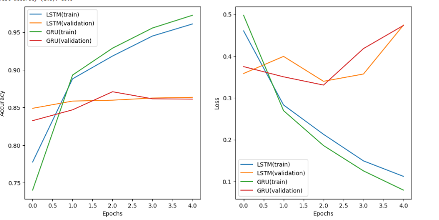

# 🎬 IMDB Sentiment Analysis with LSTM & GRU

## 📝 Problem Statement
The goal of this project is to classify **movie reviews** from the **IMDB dataset** as either **positive** or **negative**.  
We implement and compare two sequence models:
1. **LSTM (Long Short-Term Memory)**  
2. **GRU (Gated Recurrent Unit)**  

This project highlights the effectiveness of recurrent neural networks in **natural language processing (NLP)**.

---

## 🔎 Approach
1. **Dataset Preparation**:
   - Used IMDB dataset with **10,000 most frequent words**.  
   - Padded sequences to a maximum length of **200 tokens**.  

2. **Model 1 – LSTM**:
   - Architecture:
     - `Embedding(10000, 128)`  
     - `LSTM(128)`  
     - `Dense(1, sigmoid)`  

3. **Model 2 – GRU**:
   - Architecture:
     - `Embedding(10000, 128)`  
     - `GRU(128)`  
     - `Dense(1, sigmoid)`  

4. **Training**:
   - Both models trained for **5 epochs**.  
   - Batch size = **64**.  
   - Validation split = **20%**.  

5. **Evaluation**:
   - Tested both models on **25,000 unseen IMDB reviews**.  

---

## 📈 Output
- **LSTM Test Accuracy**: ~`85%`  
- **GRU Test Accuracy**: ~`86%`  

---

## 📊 Visualization
Training vs Validation Accuracy & Loss:

  

*(The plot compares LSTM vs GRU performance on IMDB reviews.)*

---

## ✅ Key Insights
- Both **LSTM** and **GRU** effectively capture long-range dependencies in text.  
- **GRU** achieves similar accuracy with fewer parameters → trains faster.  
- Recurrent models are well-suited for **sentiment analysis** tasks.  

---

## 📌 Future Improvements
- Use **Bidirectional LSTMs/GRUs** for richer context.  
- Experiment with **1D CNN + RNN hybrids**.  
- Try **pretrained embeddings (e.g., GloVe, Word2Vec, BERT)** for improved accuracy.  

---

## 🏷️ License
MIT License © 2025
