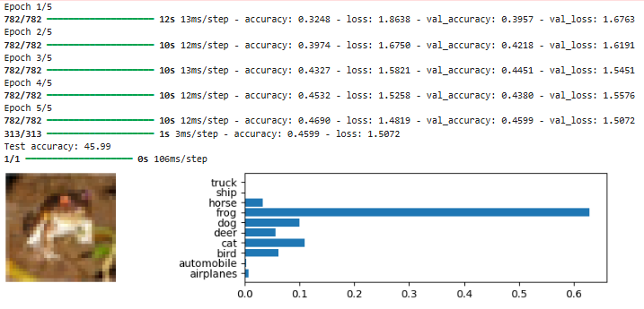

# 🧠 CIFAR-10 Image Classification with Fully Connected Neural Network

## 📝 Problem Statement
The objective of this project is to classify images from the **CIFAR-10 dataset** into 10 categories:  
`airplanes, automobile, bird, cat, deer, dog, frog, horse, ship, truck`.  
The CIFAR-10 dataset contains 60,000 32x32 color images with 50,000 training and 10,000 test samples.

---

## 🔎 Approach
1. **Dataset Loading**: The CIFAR-10 dataset was loaded using `tensorflow.keras.datasets`.  
2. **Preprocessing**:  
   - Images were normalized to `[0,1]` by dividing by 255.  
   - Labels were one-hot encoded using `to_categorical`.  
3. **Model Architecture**: A fully connected neural network (Sequential model) was built:
   - Flatten layer to convert 32x32x3 images into a 1D array  
   - Dense layers: 512 → 256 → 128 neurons with ReLU activation  
   - Output layer: 10 neurons with Softmax activation  
4. **Compilation**:  
   - Optimizer: `Adam`  
   - Loss function: `categorical_crossentropy`  
   - Metrics: `accuracy`  
5. **Training**: Model trained for 5 epochs with batch size 64, validating on the test set.  
6. **Evaluation & Prediction**:  
   - Test accuracy was evaluated.  
   - A sample image was used to visualize predicted class probabilities.  
7. **Visualization**:  
   - Sample image alongside a horizontal bar chart of predicted probabilities.

---

## 📈 Output
- **Test Accuracy:** `~46%` *(example, will vary depending on run)*  
- **Sample Prediction Visualization:**  

*(Left: sample image, Right: predicted probability distribution across 10 classes)*

---

## ✅ Key Insights
- Fully connected networks can classify small images but **do not capture spatial relationships** effectively.  
- Normalization and one-hot encoding are essential for stable training.  
- Visualization of predicted probabilities helps understand model confidence for each class.

---

## 📌 Next Steps
- Replace the FCNN with a **Convolutional Neural Network (CNN)** for better accuracy.  
- Experiment with deeper architectures, dropout, and data augmentation.  
- Plot training/validation loss and accuracy curves to monitor overfitting.
