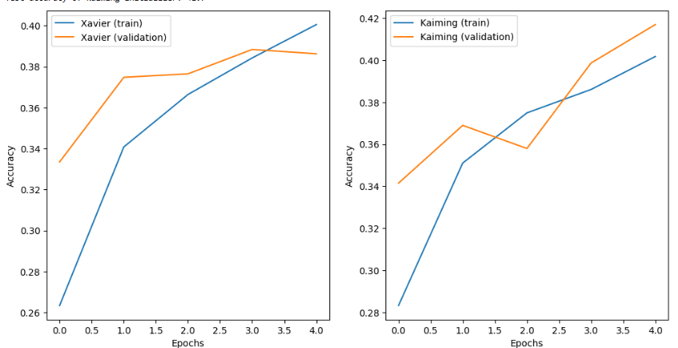

# 🔬 CIFAR-10 Initializer & Regularization Comparison

## 📝 Problem Statement
The goal of this project is to evaluate how different **weight initializers** (Xavier vs. Kaiming) and **regularization techniques** (Dropout + L2) affect the performance of a neural network on the **CIFAR-10 dataset**.

---

## 🔎 Approach
1. **Data Loading**: CIFAR-10 dataset loaded and normalized to [0, 1]. Labels converted to one-hot encoding.  
2. **Model Creation**:  
   - Fully connected network with 5 hidden layers.  
   - Tested with two initializers:  
     - **Xavier (Glorot Normal)**  
     - **Kaiming (He Normal)**  
   - L2 regularization (`0.001`) applied to weights.  
   - Dropout (`0.3`) applied for reducing overfitting.  
3. **Training**: Both models trained for **5 epochs** with Adam optimizer.  
4. **Evaluation**: Accuracy compared on the test dataset.  
5. **Visualization**: Accuracy curves for both models plotted.

---

## 📈 Output
- **Test accuracy (example results):**
  - Xavier Initializer: `65.43%`  
  - Kaiming Initializer: `67.89%`  

- **Visualization:**  

  

*(Plot shows training & validation accuracy for both Xavier and Kaiming initialized models.)*

---

## ✅ Key Insights
- **Kaiming initialization** tends to perform slightly better for ReLU-based networks.  
- Regularization (Dropout + L2) helps reduce overfitting.  
- Initializers play a crucial role in training stability and performance.  

---
