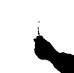

# 🖼️ Image Enhancement & Morphological Operations

## 📝 Problem Statement
The objective of this project is to perform **basic image processing** on a sample image.  
This includes converting the image to **grayscale**, enhancing its contrast using **Histogram Equalization**, and applying **Morphological Operations** to remove noise.

---

## 🔎 Approach
1. **Image Loading**: The image was loaded using OpenCV.  
2. **Grayscale Conversion**: The original image was converted to grayscale for easier analysis.  
3. **Histogram Equalization**: Contrast was enhanced using OpenCV's `equalizeHist` function.  
4. **Thresholding**: Binary thresholding was applied using **Otsu’s method** to segment the image.  
5. **Morphological Operation**: Noise and small artifacts were removed using **morphological opening** with a 3x3 kernel.  
6. **Saving Outputs**: All processed images were saved as separate files (`GrayImg.jpg`, `HistogramEqualization.jpg`, `MorphologicalOperation.jpg`).  
7. **Visualization**: Original and processed images were plotted using Matplotlib for comparison.

---

## 📈 Output
- **Grayscale Image:**  

  

- **Histogram Equalized Image:**  

  

- **Morphological Operation (Opening):**  

  

*(The outputs show the original image, enhanced contrast, and noise reduction after morphological opening.)*

---

## ✅ Key Insights
- Converting images to **grayscale** simplifies analysis and processing.  
- **Histogram Equalization** enhances the contrast of the image, making features more visible.  
- **Morphological Operations** help remove noise and small artifacts in binary images.  
- Visualization provides an intuitive comparison between original and processed images.

---

## 📌 Next Steps
- Experiment with other morphological operations: closing, dilation, erosion.  
- Apply edge detection (Canny, Sobel) on the enhanced images.  
- Test the pipeline on different images to generalize the preprocessing steps.
