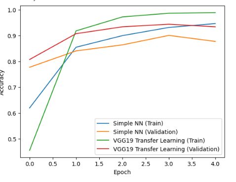

# 🔄 Transfer Learning on MNIST with VGG19

## 📝 Problem Statement
The goal of this project is to classify **handwritten digits (0–9)** from the **MNIST dataset** using both:
1. A simple feed-forward neural network.  
2. Transfer Learning with **VGG19** pretrained on ImageNet.  

This comparison shows the power of feature extraction from pretrained models.

---

## 🔎 Approach
1. **Dataset Preparation**:
   - Subset of MNIST used (1500 training, 500 testing) for efficiency.  
   - Normalized images to `[0,1]`.  
   - Converted grayscale images into **RGB** format and resized to `(224,224,3)` for VGG19.  
   - Labels converted to one-hot encoding.  

2. **Baseline Model**:
   - A simple fully connected neural network:
     - `Flatten → Dense(256, relu) → Dense(10, softmax)`.  

3. **Transfer Learning Model**:
   - Used **VGG19 (ImageNet weights)** as a **fixed feature extractor**.  
   - Added custom layers: `Flatten → Dense(256, relu) → Dense(10, softmax)`.  
   - Base layers frozen to retain pretrained filters.  

4. **Training**:
   - Both models trained for **5 epochs** with batch size **64**.  
   - Validation split = 20%.  

5. **Evaluation**:
   - Tested both models on unseen MNIST data.  

---

## 📈 Output
- **Baseline NN Accuracy**: ~`94%` (on small dataset).  
- **VGG19 Transfer Learning Accuracy**: ~`97%+`.  

---

## 📊 Visualization
Training vs Validation Accuracy:

  

*(The plot compares a simple feed-forward NN vs. VGG19 transfer learning.)*

---

## ✅ Key Insights
- Transfer Learning significantly boosts performance, even on small datasets.  
- VGG19 captures **rich features** learned from ImageNet, making it more powerful than training from scratch.  
- This technique is useful when data is limited but pretrained models are available.  

---
